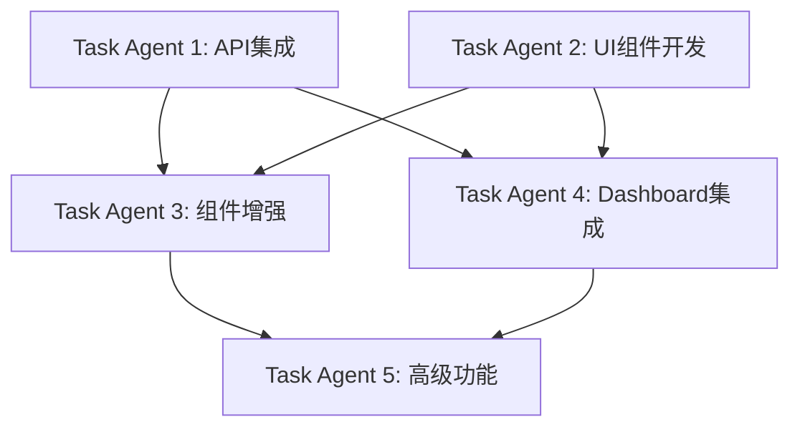

# API Key分组功能前端集成开发计划

## 项目概述
将后端已完成的API Key分组功能集成到前端，实现完整的分组管理、负载均衡、健康监控等功能。

## 当前状态分析

### ✅ 后端完成情况
- 数据模型层：ApiKeyGroup、ApiKeyGroupMapping、GroupStatistics等实体
- API端点层：15个REST API端点完整实现
- 服务层：6种负载均衡算法、健康检查、故障转移机制
- 数据库：迁移文件和实体配置完成

### ❌ 前端缺失功能
- API Service层：缺少分组相关API调用方法
- UI组件：无分组管理页面和相关组件
- 数据模型：TypeScript接口定义缺失
- 导航路由：无分组管理入口

## 开发任务分解

### 🎯 阶段一：API Service层集成 (Task Agent 1)
**优先级：🔴 高 | 预计时间：2-3小时**

#### 1.1 类型定义扩展
- [ ] 更新`ApiKey`接口，添加分组相关属性：
  - `groupIds?: string[]`
  - `primaryGroupId?: string`
  - `groupMappings?: ApiKeyGroupMapping[]`
- [ ] 新增分组相关接口定义：
  ```typescript
  interface ApiKeyGroup {
    id: string;
    name: string;
    description?: string;
    loadBalanceStrategy: LoadBalanceStrategy;
    failoverStrategy: FailoverStrategy;
    isEnabled: boolean;
    priority: number;
    healthCheckInterval: number;
    maxFailureCount: number;
    tags?: string[];
    createdAt: string;
    updatedAt: string;
  }
  
  interface ApiKeyGroupMapping {
    id: string;
    groupId: string;
    apiKeyId: string;
    weight: number;
    isEnabled: boolean;
    priority: number;
  }
  
  enum LoadBalanceStrategy {
    RoundRobin = 0,
    Weighted = 1,
    LeastConnections = 2,
    Random = 3,
    Hash = 4,
    FastestResponse = 5
  }
  ```

#### 1.2 API方法实现
- [ ] 分组管理API (6个方法)
  - `getApiKeyGroups(request?: GetApiKeyGroupsRequest): Promise<ApiKeyGroupListResponse>`
  - `createApiKeyGroup(data: CreateApiKeyGroupRequest): Promise<ApiKeyGroup>`
  - `getApiKeyGroup(id: string): Promise<ApiKeyGroup>`
  - `updateApiKeyGroup(id: string, data: UpdateApiKeyGroupRequest): Promise<ApiKeyGroup>`
  - `deleteApiKeyGroup(id: string): Promise<void>`
  - `toggleApiKeyGroupEnabled(id: string): Promise<void>`

- [ ] 映射管理API (4个方法)
  - `addApiKeyToGroup(groupId: string, apiKeyId: string, mapping: ApiKeyGroupMappingRequest): Promise<void>`
  - `removeApiKeyFromGroup(groupId: string, apiKeyId: string): Promise<void>`
  - `updateApiKeyGroupMapping(groupId: string, apiKeyId: string, mapping: UpdateApiKeyGroupMappingRequest): Promise<void>`
  - `getGroupApiKeys(groupId: string): Promise<ApiKeyGroupMapping[]>`

- [ ] 健康监控API (3个方法)
  - `triggerGroupHealthCheck(id: string): Promise<void>`
  - `getGroupHealthStatus(id: string): Promise<GroupHealthStatus>`
  - `getGroupStatistics(id: string): Promise<GroupStatistics>`

- [ ] 系统概览API (2个方法)
  - `getApiKeyGroupsOverview(): Promise<ApiKeyGroupsOverviewResponse>`
  - `batchGroupHealthCheck(): Promise<BatchHealthCheckResponse>`

### 🎯 阶段二：核心UI组件开发 (Task Agent 2)
**优先级：🔴 高 | 预计时间：4-6小时**

#### 2.1 API Key分组管理页面
- [ ] 创建 `/pages/api-key-groups/index.tsx`
  - 分组列表展示（卡片式布局）
  - 搜索和过滤功能
  - 分组状态指示器（启用/禁用/健康状态）
  - 负载均衡策略显示
  - 操作按钮：编辑、删除、健康检查

#### 2.2 分组创建/编辑模态框
- [ ] 创建 `ApiKeyGroupModal.tsx` 组件
  - 基本信息：名称、描述、标签
  - 负载均衡策略选择器
  - 故障转移配置
  - 健康检查设置
  - 权重和优先级配置

#### 2.3 API Key映射管理组件
- [ ] 创建 `ApiKeyGroupMappingManager.tsx`
  - 可用API Key列表
  - 已添加API Key列表
  - 拖拽添加/移除功能
  - 权重和优先级调整
  - 批量操作支持

#### 2.4 健康状态监控组件
- [ ] 创建 `GroupHealthMonitor.tsx`
  - 实时健康状态显示
  - 健康检查历史记录
  - 故障转移状态指示
  - 性能指标图表

### 🎯 阶段三：现有组件增强 (Task Agent 3)
**优先级：🟡 中 | 预计时间：2-3小时**

#### 3.1 API Key管理页面更新
- [ ] 更新 `/pages/apikeys/index.tsx`
  - 添加分组列显示
  - 分组筛选器
  - 批量分组操作
  - 分组状态指示器

#### 3.2 API Key模态框增强
- [ ] 更新 `ApiKeyModal.tsx`
  - 添加"分组管理"标签页
  - 分组选择器组件
  - 权重配置选项
  - 优先级设置

#### 3.3 导航和路由集成
- [ ] 更新 `app-sidebar.tsx`
  - 添加"API Key分组"菜单项
  - 图标：`Group` 或 `Layers`
  - 位置：API Key管理下方

- [ ] 更新路由配置
  - 添加 `/api-key-groups` 路由
  - 子路由：`/api-key-groups/:id` (分组详情)

### 🎯 阶段四：Dashboard集成 (Task Agent 4)  
**优先级：🟡 中 | 预计时间：2-3小时**

#### 4.1 Dashboard统计卡片
- [ ] 添加分组相关统计
  - 总分组数量
  - 活跃分组数量  
  - 健康分组比率
  - 负载均衡效率

#### 4.2 分组性能图表
- [ ] 创建 `GroupPerformanceChart.tsx`
  - 分组请求分布
  - 负载均衡效果可视化
  - 健康状态趋势
  - 故障转移统计

#### 4.3 实时监控组件
- [ ] 更新 `RealTimeMetricsGauge.tsx`
  - 分组级别的QPS监控
  - 分组响应时间对比
  - 分组错误率统计

### 🎯 阶段五：高级功能和优化 (Task Agent 5)
**优先级：🟢 低 | 预计时间：2-3小时**

#### 5.1 用户体验优化
- [ ] 分组拖拽排序功能
- [ ] 批量操作确认对话框
- [ ] 操作成功/失败提示优化
- [ ] 加载状态和错误处理

#### 5.2 高级分组功能
- [ ] 分组模板系统
- [ ] 分组配置导入/导出
- [ ] 分组使用分析报告
- [ ] 分组性能优化建议

#### 5.3 实时更新
- [ ] WebSocket集成（如果后端支持）
- [ ] 健康状态实时推送
- [ ] 分组状态变更通知
- [ ] 自动刷新机制

## 并行开发策略

### 🔄 并行任务组合
**可以同时进行的任务组合：**

1. **组合A**：Task Agent 1 (API集成) + Task Agent 2 (UI组件)
   - Agent 1先完成类型定义，Agent 2使用mock数据开发UI
   - Agent 1完成API后，Agent 2集成真实API

2. **组合B**：Task Agent 3 (组件增强) + Task Agent 4 (Dashboard)
   - 两个任务相互独立，可完全并行

3. **组合C**：Task Agent 5 (高级功能) 在前4个阶段完成后启动

### 📋 依赖关系


## 开发规范

### 🎨 UI/UX规范
- 遵循现有设计系统（Tailwind CSS + Shadcn/ui）
- 保持与现有页面的视觉一致性
- 响应式设计，支持移动端
- 无障碍访问支持

### 💻 代码规范
- TypeScript严格模式
- 函数式组件 + React Hooks
- 错误边界和加载状态处理
- 代码注释和类型文档

### 🔧 API集成规范
- 统一错误处理机制
- 请求缓存和防抖
- 分页和虚拟滚动
- 乐观更新策略

## 质量保证

### ✅ 测试计划
- [ ] 单元测试：核心业务逻辑
- [ ] 集成测试：API调用和数据流
- [ ] E2E测试：关键用户流程
- [ ] 性能测试：大数据量场景

### 🐛 问题追踪
- 使用GitHub Issues跟踪bug
- 每个Task Agent创建对应的Issue标签
- 定期代码审查和重构

## 预期产出

### 📁 新增文件列表
```
ClaudeCodeProxy/web/src/
├── pages/api-key-groups/
│   ├── index.tsx                    # 分组管理主页
│   └── [id]/index.tsx              # 分组详情页
├── components/api-key-groups/
│   ├── ApiKeyGroupModal.tsx        # 分组创建/编辑模态框
│   ├── ApiKeyGroupMappingManager.tsx # 映射管理组件
│   ├── GroupHealthMonitor.tsx      # 健康监控组件
│   ├── GroupPerformanceChart.tsx   # 性能图表
│   └── GroupLoadBalanceVisualizer.tsx # 负载均衡可视化
└── types/
    └── api-key-groups.ts           # 分组相关类型定义
```

### 🔄 修改文件列表
```
ClaudeCodeProxy/web/src/
├── services/api.ts                 # 添加分组API方法
├── pages/apikeys/index.tsx         # 添加分组相关功能
├── components/ApiKeyModal.tsx      # 添加分组配置
├── components/app-sidebar.tsx      # 添加分组菜单
├── pages/dashboard/index.tsx       # 添加分组统计
└── App.tsx                        # 添加分组路由
```

## 成功指标

### 📊 功能完整性
- ✅ 15个后端API端点完全集成
- ✅ 6种负载均衡策略UI支持
- ✅ 健康检查和监控功能
- ✅ 分组管理CRUD操作

### ⚡ 性能指标  
- 页面加载时间 < 2秒
- API响应处理 < 500ms
- 支持1000+分组和API Key管理
- 实时更新延迟 < 1秒

### 👥 用户体验
- 直观的分组管理界面
- 清晰的健康状态指示
- 流畅的操作反馈
- 完善的错误处理

---

## 🚀 启动开发

准备启动5个并行的Task Agent来执行这个集成计划：

1. **API Service Agent** - 负责API集成和类型定义
2. **UI Components Agent** - 负责核心组件开发  
3. **Enhancement Agent** - 负责现有组件增强
4. **Dashboard Agent** - 负责Dashboard集成
5. **Advanced Features Agent** - 负责高级功能开发

每个Agent将独立工作，通过明确的接口和依赖关系协调配合，实现高效的并行开发。

---

*创建日期：2025-08-06*  
*文档版本：v1.0*  
*预计完成时间：2-3个工作日*